```mermaid
sequenceDiagram
    autonumber
    participant U as 🧑 Usuario
    participant C as 💻 Cliente (App/Browser)
    participant STT as 🤖 Speech-to-Text (AI)
    participant LLM as 🧠 LLM (AI)
    participant DB as 🗄️ Database

    Note over C,U: El cliente reproduce la pregunta en audio (TTS local o externo)
    C->>U: "¿Cuál es tu nombre?"
    U->>C: Respuesta en voz

    C->>STT: Enviar audio
    STT-->>C: Texto transcrito

    C->>LLM: Validar si la transcripción responde la pregunta
    LLM-->>C: "Respuesta válida" o "No respondió"

    alt Respuesta válida
        C->>DB: Guardar {pregunta, respuesta}
        C->>U: Siguiente pregunta (audio)
    else No respondió
        C->>U: Repetir pregunta (audio)
    end

    Note over C,DB: Al final → se guarda el formulario completo

```

# **Construyendo un agente de voz para formularios usando FastAPI y Groq**

## **Descripción**

Actualmente, las aplicaciones de la inteligencia artificial (AI) se han vuelto cada vez más populares en diferentes sectores económicos, pero quiero hacer hincapié en el área de atención al cliente, el cual paso del uso de chatbots con procedimientos rígidos al uso de herramientas de procesamiento de lenguaje natural (NLP) mediante los Large Language Models (LLMs).

Hace poco tuve la idea de crear un **agente de voz para formularios desde cero** con el objetivo que el cliente (a partir de ahora denotaré al usuario como cliente) pueda completar los formularios que se presenten en su actividad laboral, sin tener que escribir directamente los datos, sino utilizando su voz para agilizar el proceso reduciendo el tiempo de ingesta de datos. Sin embargo, antes de lanzarse a _codear_ es importante entender cuál es el proceso detrás del telón y, a partir de ello, construir la herramienta. La idea me parece genial y más aún que consideré documentar el proceso de desarrollo, para que los demás puedan replicar y mejorar la aplicación.

Por ahora, me enfocaré en el desarrollo del back-end ya que considero que es la parte fundamental para que el cliente (web/mobile app) pueda interactuar con nuestro agente. Utilizaré <a href="https://apidog.com/?utm_source=google_search&utm_medium=g&utm_campaign=21950794503&utm_content=174276878794&utm_term=postman&gad_source=1&gad_campaignid=21950794503&gbraid=0AAAAA-gKXrAXuQ5SDywhkC-p3I7Q1GrPk&gclid=Cj0KCQjwuKnGBhD5ARIsAD19RsZMH8AR5znhCr0T3MPvjfuflAkfQJa3YVRNtnNnpNug5e4DvTL_mgoaAl6CEALw_wcB" target="_blank">Apidog</a> como plataforma de desarrollo de APIs para probar los endpoints.

A continuación, detallaré los pasos para clonar el presente [repositorio](https://github.com/SebastianUrdaneguiBisalaya/building-a-voice-agents-for-forms) en tu máquina y puedas seguir la explicación de cada uno de los pasos, y si deseas, realizar los cambios que consideres necesarios para adaptarlo a tus necesidades.

En esta ocasión, utilizaré [FastAPI](https://fastapi.tiangolo.com/) como framework para crear el back-end y [Groq](https://groq.com/) para conectarme a los modelos de AI y obtener los resultados.

> [!note]
> Puedes desarrollar esta aplicación en el framework de tu preferencia como [Express.js](https://expressjs.com/), [NestJS](https://nestjs.com/), [Route Handlers de Next.js](p), etc. Eligo [FastAPI](https://fastapi.tiangolo.com/) por el alto rendimiento, la facilidad de uso y utiliza el lenguaje de programación [Python](https://www.python.org/), logrando que el desarrollo se más fácil y robusto.

## **Instalación**

Dirígete a la terminal y ejecuta los siguientes comandos:

Clonar el repositorio

```bash
git clone
```

Crea un entorno virtual

```bash
python -m venv venv
```

Activar el entorno virtual

```bash title="fib.ex" showLineNumbers /palindrome/#v
source venv/bin/activate # (masOS)
venv\Scripts\activate # (Windows)
```

Instalar las dependencias

```bash
pip install -r requirements.txt
```

Crear un archivo ```.env``` en la raíz del proyecto con las siguientes variables de entorno:

```bash
ENVIRONMENT=development # (development o production)
API_GROQ=****************
```

Ejecutar el servidor

```bash
fastapi dev src/app/main.py
```

## **Lógica de negocio**

### WebSocket

**WebSocket** es un protocolo de comunicación que permite establcer una comunicación bidireccional y de larga duración entre un cliente y un servidor.

Existen otros protocolos de comunicación como **HTTP**, **HTTP/2 Streaming**, **Server-Sent Events (SSE)**, **WebRTC**, etc. Sin embargo, para nuestro caso, nos centraremos en **WebSocket** para establecer una comunicación persistente y fluida entre el cliente y el servidor.

El siguiente diagrama muestra el flujo de comunicación entre el cliente y el servidor utilizando **WebSocket**:

```mermaid
sequenceDiagram
    autonumber
    participant C as 💻 Cliente
    participant S as ⛃ Servidor

    C->>S: Handshake (HTTP actualización)
    S-->>C: Conexión abierta
    C<<->>S: Mensajes bidireccionales
    Note over C,S: Conexión abierta y persistente
    C<<->>S: Una parte cierra la conexión
    Note over C,S: Conexión cerrada
```



Básicamente, el cliente realiza una petición HTTP para establecer una conexión bidireccional y duradera con el servidor, este proceso se conoce como **handshake**. Una vez establecida la conexión, el cliente envía mensajes bidireccionales a través de la conexión y el servidor responde a los mensajes enviados.

### WebSocket en FastAPI

> [!TIP]
> Empezaremos desde un nivel básico para entender cómo funciona el proceso y culminaremos en un nivel avanzado con la implementación del agente de voz para formularios.

```python
from fastapi import APIRouter, WebSocket

class ConnectionManager:
    def __init__(self):
        self.active_connections: list[WebSocket] = []

    async def connect(self, websocket: WebSocket):
        await websocket.accept()
        self.active_connections.append(websocket)

    def disconnect(self, websocket: WebSocket):
        self.active_connections.remove(websocket)

    async def send_personal_message(self, message: str, websocket: WebSocket):
        await websocket.send_text(message)

    async def broadcast(self, message: str):
        for connection in self.active_connections:
            await connection.send_text(message)


manager = ConnectionManager()

router = APIRouter(
    prefix="/api/v1",
    tags=["Voice Agents"],
    responses={404: {"description": "Not found"}},
)

@router.websocket("/ws/voice-agents")
async def voice_agents(websocket: WebSocket):
    try:
      await manager.connect(websocket)
    except Exception as e:
      await manager.disconnect(websocket)
      return
		
    try:
      while True:
        data = await websocket.receive_text()
        await manager.send_personal_message(f"Received: {data}", websocket)
    except WebSocketDisconnect:
    except Exception as e:
        await manager.disconnect(websocket)
        return
```

