# **Agente de Voz para Formularios: Una guía práctica con FastAPI y Groq**

Las aplicaciones de la **inteligencia artificial (IA)** se han vuelto cada vez más populares en diferentes sectores, especialmente en la atención al cliente, donde hemos pasado de chatbots con lógicas rígidas a herramientas avanzadas de **procesamiento de lenguaje natural (NLP)** basadas en **Large Language Models (LLMs)**.

Recientemente, tuvimos la idea de crear un **agente de voz para formularios desde cero** con el objetivo de que el usuario pudiera completar formularios utilizando su voz para agilizar el proceso y reducir el tiempo de entrada de datos. Sin embargo, antes de lanzarse a codear, es crucial entender el proceso que hay detrás para construir la herramienta de manera robusta. Consideramos que la idea es excelente y, por eso, decidimos documentar el proceso de desarrollo para que otros puedan replicar y mejorar la aplicación.

En este artículo, nos enfocaremos en el desarrollo del back-end, ya que lo consideramos la parte fundamental para que el cliente (web o mobile) pueda interactuar con nuestro agente.

A continuación, detallaremos los pasos para clonar el <span href="https://github.com/SebastianUrdaneguiBisalaya/building-a-voice-agents-for-forms" target="_blank">repositorio</span> en tu ordenador y así puedas seguir la explicación. Si lo deseas, puedes realizar los cambios que consideres necesarios para adaptarlo a tus necesidades.

Para este proyecto utilizaremos <span href="https://fastapi.tiangolo.com/" target="_blank">FastAPI</span> como framework para crear el back-end y <span href="https://groq.com/" target="_blank">Groq</span> para conectarnos a los modelos de IA y obtener los resultados.

> [!NOTE]
> Puedes desarrollar esta aplicación en el framework de tu preferencia, como <span href="https://expressjs.com/" target="_blank">Express.js</span>, <span href="https://nestjs.com/" target="_blank">NestJS</span>, etc. Elegimos **FastAPI** por su alto rendimiento, facilidad de uso y por ser compatible con el lenguaje de programación <span href="https://www.python.org/" target="_blank">Python</span>, logrando un desarrollo más versátil y robusto.

## **Instalación**

### **Servidor**

Dirígete a la terminal y ejecuta los siguientes comandos:

- Clonar el repositorio:

```bash
git clone https://github.com/SebastianUrdaneguiBisalaya/building-a-voice-agents-for-forms
```

- Moverse al directorio del servidor:

```bash
cd building-a-voice-agents-for-forms
```

- Crea un entorno virtual:

```bash
python -m venv venv
```

- Activar el entorno virtual:

```bash
source venv/bin/activate # (masOS)
venv\Scripts\activate # (Windows)
```

- Instalar las dependencias:

```bash
pip install -r requirements.txt
```

- Crear un archivo ```.env``` en la raíz del proyecto con las siguientes variables de entorno:

```bash
ENVIRONMENT=development # (development o production)
API_GROQ=****************
```

- Ejecutar el servidor:

```bash
fastapi dev src/app/main.py
```

### **Cliente**

- Moverse al directorio del cliente:

```bash
cd building-a-voice-agents-for-forms/client
```

- Instalar las dependencias:

```bash
pnpm install
```

- Ejecutar el servidor de desarrollo del cliente:

```bash
pnpm dev
```

## **Lógica de negocio**

### **WebSocket**

**WebSocket** es un protocolo de comunicación que permite establecer una conexión bidireccional y de larga duración entre un cliente y un servidor.

Aunque existen otros protocolos de comunicación como **HTTP**, **HTTP/2 Streaming**, **Server-Sent Events (SSE)**, **WebRTC**, para nuestro caso, nos centraremos en **WebSocket** para establecer una comunicación persistente y fluida entre el cliente y el servidor.

El siguiente diagrama muestra el flujo de comunicación básico utilizando **WebSocket**:

```mermaid
sequenceDiagram
    autonumber
    participant C as 💻 Cliente
    participant S as ⛃ Servidor

    C->>S: Handshake (HTTP actualización)
    S-->>C: Conexión abierta
    C<<->>S: Mensajes bidireccionales
    Note over C,S: Conexión abierta y persistente
    C<<->>S: Una parte cierra la conexión
    Note over C,S: Conexión cerrada
```



Básicamente, el cliente realiza una petición HTTP para establecer una conexión bidireccional y duradera con el servidor; este proceso se conoce como **handshake**. Una vez establecida la conexión, cliente y servidor pueden enviar y recibir mensajes de forma fluida.

Teniendo en cuenta el flujo del websocket, podemos construir el proceso de tal forma que el cliente tenga una interacción fluida y natural con el agente de voz.

```mermaid
sequenceDiagram
    autonumber
    participant U as 🧑 Usuario
    participant C as 💻 Cliente (App/Browser)
    participant STT as 🤖 Speech-to-Text (AI)
    participant LLM as 🧠 LLM (AI)
    participant DB as 🗄️ Database

    Note over C,U: El cliente reproduce la pregunta <br>en audio (TTS local o externo)
    C->>U: "¿Cuál es tu nombre?"
    U->>C: Respuesta en voz

    C->>STT: Enviar audio
    STT-->>C: Texto transcrito

    C->>LLM: Validar si la transcripción responde la pregunta
    LLM-->>C: "Respuesta válida" o "No respondió"

    alt Respuesta válida
        C->>DB: Guardar {pregunta, respuesta}
        C->>U: Siguiente pregunta (audio)
    else No respondió
        C->>U: Repetir pregunta (audio)
    end

    Note over C,DB: Al final → se guarda el formulario completo
```



### **Proceso en FastAPI**

El archivo ```config.py``` se encarga de la gestión de las variables de entorno. Utiliza ```python-dotenv``` para cargar las variables desde el archivo ```.env``` y ```Pydantic``` para validar y tipar de forma segura estas variables, garantizando que la aplicación no se inicie si falta alguna configuración crítica. 

```python title="src/config/config.py"
import os
from pydantic import ValidationError, Field
from pydantic_settings import BaseSettings
from dotenv import load_dotenv

BASE_DIR = os.path.dirname(os.path.join(os.path.dirname(__file__), ".."))

load_dotenv(BASE_DIR)


class Settings(BaseSettings):
    environment: str = Field(..., alias="ENVIRONMENT")
    api_groq: str = Field(..., alias="API_GROQ")

    model_config = {
        "env_file": ".env",
        "env_file_encoding": "utf-8",
        "extra": "ignore",
    }


def get_settings():
    try:
        settings = Settings()
        return settings
    except ValidationError as e:
        print(f"The environment variables are not set. {e}")
        raise e


settings = get_settings()
```

El archivo ```classes.py``` define las clases clave para el manejo de la sesión y la conectividad. La clase ```ConnectionManager``` gestiona las conexiones WebSocket activas, con métodos para conectar, desconectar y enviar mensajes individuales o a todos los clientes (broadcast). Esto es útil para manejar la persistencia de la conexión (ej. con mensajes 'ping').

La clase ```FormSession``` es el corazón de la lógica del formulario. Se encarga de llevar un registro de la sesión de un usuario, controlando el índice de la pregunta actual, almacenando las respuestas validadas y determinando si el formulario está completo. Aunque actualmente los datos se almacenan en memoria, este diseño facilita la futura integración con una base de datos.

```python title="src/classes/classes.py"
from typing import Any, Dict
from fastapi import WebSocket


class ConnectionManager:
    def __init__(self):
        self.active_connections: list[WebSocket] = []

    async def connect(self, websocket: WebSocket):
        await websocket.accept()
        self.active_connections.append(websocket)

    def disconnect(self, websocket: WebSocket):
        self.active_connections.remove(websocket)

    async def send_personal_message(self, message: str, websocket: WebSocket):
        await websocket.send_text(message)

    async def broadcast(self, message: str):
        disconnected = []
        for connection in self.active_connections:
            try:
                await connection.send_text(message)
            except Exception as e:
                disconnected.append(connection)

        for conn in disconnected:
            self.disconnect(conn)


class FormSession:
    def __init__(self, questions: list[dict]):
        self.current_index = 0
        self.questions = questions
        self.answers: Dict[str, Any] = {}
        self.completed = False

    def current_question(self) -> dict:
        return self.questions[self.current_index]

    def record_answer(self, key: str, value: Any):
        self.answers[key] = value
        self.current_index += 1
        if self.current_index >= len(self.questions):
            self.completed = True


manager = ConnectionManager()
```

Si estás familiarizado con el tipado de datos en **TypeScript**, te resultará similar el uso de **Pydantic** en Python. La clase ```BaseModel``` nos permite definir esquemas de datos estructurados y validados, lo cual es fundamental para el manejo de las entradas y salidas de las funciones de la API.

> [!TIP]
> Sugerimos siempre tipar el código, ya que es una buena práctica de programación que previene errores y mejora la legibilidad.

```python title="src/models/models.py"
from pydantic import BaseModel
from typing import Optional, TypeVar

T = TypeVar("T")

class TranscriptionGroq(BaseModel):
    audio_base64: str
    language: str


class MessagesGroq(BaseModel):
    role: str
    content: str


class GreetingGroq(BaseModel):
    language: str
    current_question: str


class ValidateDataGroq(BaseModel):
    language: str
    current_question: str
    next_question: Optional[str] = None
    transcription: str
    expected_type: str


class APIResponseValidationGroq(BaseModel):
    is_response_valid: bool
    normalized_value: Optional[T] = None
    reply_message: str
```

El archivo ```groq.py``` encapsula la lógica de la interacción con la API de Groq. Cada función aquí se comunica con un modelo de IA específico para una tarea: ```greeting_groq``` para generar un saludo inicial, ```transcription_groq``` para transcribir audio y ```validate_data_groq``` para validar y normalizar la respuesta del usuario. Es importante destacar que cada función utiliza un prompt cuidadosamente diseñado para guiar al modelo y obtener la respuesta deseada, incluyendo el formato de salida esperado.

```python title="src/lib/groq.py"
from src.config.config import settings
from src.models.models import GreetingGroq, TranscriptionGroq, ValidateDataGroq, MessagesGroq, APIResponseValidationGroq
from groq import Groq, AsyncGroq
import json

_GROQ_CLIENT = Groq(
    api_key=settings.api_groq,
)

_ASYNC_GROQ_CLIENT = AsyncGroq(
    api_key=settings.api_groq,
)


async def greeting_groq(data: GreetingGroq):
    response = await _ASYNC_GROQ_CLIENT.chat.completions.create(
        model="openai/gpt-oss-20b",
        messages=[
            MessagesGroq(
                role="system",
                content=(
                    f"You are a helpful assistant taking form responses.\n"
                    f"You just greeted the user and must ask them the first question.\n"
                    f"Your name is Clara.\n"
                    f"The current question is: {data.current_question}.\n"
                    f"The language that you must use is: {data.language}.\n"
                    f"If the questions are not in the same language of {data.language}, you must translate them.\n"
                    f"Example:\n"
                    f"If the current question is 'What is your name?' and the language is Spanish, you must return the question in Spanish.\n"
                    f"'What is your name?' Hola, yo soy Clara, encargada de conducir el siguiente formulario. Empecemos, la primera pregunta es: ¿Cuál es tu nombre?'\n"
                    f"Your greeting should be polite and friendly.\n"
                    f"Important: Output must be plain text only, without Markdown, bold (**), italics, quotes, or any extra symbols.\n"
                ),
            ),
        ],
        temperature=0.3,
        stream=False,
    )
    return response.choices[0].message.content


def transcription_groq(data: TranscriptionGroq):
    transcription = _GROQ_CLIENT.audio.transcriptions.create(
        url=data.audio_base64,
        model="whisper-large-v3-turbo",
        prompt=(
            f"Context:\n"
            f"You are a helpful assistant. Your name is Clara. You must determine language of the audio.\n"
            f"Then, you must translate the audio to {data.language} and return the transcription.\n"
            f"Example:\n"
            f"If the audio is in English, you must return the transcription in {data.language}.\n"
        ),
        response_format="verbose_json",
        language=data.language,
        temperature=0.3,
    )
    return transcription.text.strip()


async def validate_data_groq(data: ValidateDataGroq):
    response = await _ASYNC_GROQ_CLIENT.chat.completions.create(
        model="openai/gpt-oss-20b",
        messages=[
            MessagesGroq(
                role="system",
                content=(
                    f"You are a helpful assistant taking form responses.\n"
                    f"The current question is: {data.current_question}.\n"
                    f"The expected type is: {data.expected_type}.\n"
                    f"The next question is: {data.next_question}.\n"
                    f"If the questions are not in the same language of {data.language}, you must translate them.\n"
                    f"The language that you must use is: {data.language}.\n"
                    f"Instructions:\n"
                    f"1. Always validate if the user response matches the expected type.\n"
                    f"2. If valid:\n"
                    f"   - Normalize the value (e.g., 'twenty-four' -> 24, 'juan at gmail dot com' -> 'juan@gmail.com').\n"
                    f"   - Confirm politely to the user.\n"
                    f"   - If there is a next question, include it naturally in the reply.\n"
                    f"   - If there is no next question, thank the user and say the form is complete.\n"
                    f"3. If invalid:\n"
                    f"   - Politely explain why the answer is invalid.\n"
                    f"   - Repeat the current question again, naturally.\n"
                    f"4. Always return JSON only with the following structure:\n"
                    f"{{\n"
                    f"  'is_response_valid': bool,\n"
                    f"  'normalized_value': Any or null,\n"
                    f"  'reply_message': str  # human-like, polite response with either the next or current question\n"
                    f"}}\n"
                    f"Important: Output of 'reply_message' must be plain text only, without Markdown, bold (**), italics, quotes, or any extra symbols.\n"
                )
            ),
            MessagesGroq(
                role="user",
                content=data.transcription,
            ),
        ],
        temperature=0.3,
        stream=False,
        response_format={
            "type": "json_schema",
            "json_schema": {
                "name": "api_response_validation_groq",
                "schema": APIResponseValidationGroq.model_json_schema()
            }
        }
    )
    api_response_validation = APIResponseValidationGroq.model_validate(
        json.loads(response.choices[0].message.content))
    return api_response_validation
```

Este archivo (```voice_agents.py```) actúa como el **"cerebro"** del back-end, controlando el flujo de interacción a través del WebSocket. La ruta ```/api/v1/ws/voice-agents``` maneja la comunicación bidireccional entre el cliente y el servidor. Al conectarse, el servidor inicia la sesión del formulario para el ```user_id``` y ```language``` proporcionados. Se envía un saludo inicial con la primera pregunta del formulario. En cada interacción, el servidor:

1. Recibe el audio del usuario.

2. Utiliza las funciones de ```groq.py``` para transcribir, validar y normalizar la respuesta.

3. Si la respuesta es válida, avanza a la siguiente pregunta y la envía al cliente.

4. Si la respuesta es inválida, envía un mensaje de error y repite la pregunta actual.

5. Cuando el formulario está completo, envía las respuestas recopiladas y cierra el flujo.

> [!WARNING]
> Este enfoque delega la validación de datos al LLM, pero mantiene el control del flujo del formulario en el back-end, asegurando que se sigan todas las preguntas y se maneje la lógica de forma predecible.

```python title="src/app/routers/voice_agents.py"
from fastapi import APIRouter, WebSocket, WebSocketDisconnect
from typing import Dict
from src.config.config import settings
from src.classes.classes import manager, FormSession
from src.lib.groq import greeting_groq, transcription_groq, validate_data_groq
from src.models.models import GreetingGroq, TranscriptionGroq, ValidateDataGroq
import logging

level = logging.INFO if settings.environment == "development" else logging.WARNING

logging.basicConfig(level=level)
logger = logging.getLogger(__name__)

router = APIRouter(
    prefix="/api/v1",
    tags=["Voice Agents"],
    responses={404: {"description": "Not found"}},
)

sessions: Dict[str, FormSession] = {}


@router.websocket("/ws/voice-agents")
async def voice_agents(websocket: WebSocket):
    try:
        await manager.connect(websocket)
        user_id = websocket.query_params.get("user_id")
        language = websocket.query_params.get("language")
        print(user_id, language)
        sessions[user_id] = FormSession([
                                        {"key": "age", "question": "What is your age?",
                                            "type": "int"},
                                        {"key": "email", "question": "What is your email?",
                                            "type": "str"},
                                        {"key": "phone", "question": "What is your phone number?",
                                            "type": "str"},
                                        ])
        session = sessions[user_id]
        greeting = await greeting_groq(GreetingGroq(
            language=language,
            current_question=session.current_question()['question'],
        ))
        await websocket.send_text(greeting)
        while True:
            data = await websocket.receive_json()
            audio_base_64 = data.get("audio")
            if not audio_base_64:
                await websocket.send_text("No audio received")
                continue
            transcription = transcription_groq(
                TranscriptionGroq(
                    audio_base64=audio_base_64,
                    language=language,
                )
            )
            current_question = session.current_question()
            next_question = None if session.current_index + \
                1 >= len(session.questions) else session.questions[session.current_index + 1]
            result = await validate_data_groq(ValidateDataGroq(
                language=language,
                current_question=current_question["question"],
                next_question=next_question["question"] if next_question else None,
                transcription=transcription,
                expected_type=current_question["type"],
            ))
            if not result.is_response_valid:
                await websocket.send_json({
                    "message": f"{result.reply_message}",
                })
                continue
            session.record_answer(
                current_question["key"], result.normalized_value)
            if session.completed:
                await websocket.send_json({
                    "message": f"{result.reply_message}",
                    "answers": session.answers,
                })
                break
            else:
                next_question = session.current_question()
                await websocket.send_json({
                    "message": f"{result.reply_message}",
                })
    except WebSocketDisconnect:
        manager.disconnect(websocket)
        logger.info(f"Client disconnected: {websocket.client}")
    except Exception as e:
        manager.disconnect(websocket)
        logger.error(f"Websocket error: {e}", exc_info=True)
        await websocket.close(code=1011, reason="Internal server error")
```

El archivo ```main.py``` es nuestro punto de entrada a las rutas de la API. Aquí se definen las rutas que se utilizarán para la comunicación entre el cliente y el servidor, así como se configuran los middlewares necesarios para el funcionamiento de la aplicación.

```python title="src/app/main.py"
from fastapi import FastAPI
from fastapi.middleware.cors import CORSMiddleware
from src.config.config import settings
from src.app.routes import voice_agents

is_production = settings.environment == "production"

app = FastAPI(
    title="Building a voice agents for forms",
    description="Using FastAPI and Groq API",
    version="1.0.0",
    terms_of_service=None,
    docs_url="/docs",
    redoc_url="/redoc",
    contact={
        "name": "Sebastian Marat Urdanegui Bisalaya",
        "url": "https://sebastianurdanegui.vercel.app/",
        "email": "sebasurdanegui@gmail.com"
    }
)

origins = [
    "http://localhost:5173",
]

app.add_middleware(
    CORSMiddleware,
    allow_origins=origins,
    allow_credentials=True,
    allow_methods=["GET", "POST", "PUT", "DELETE", "PATCH"],
    allow_headers=["*"],
)

app.include_router(voice_agents.router)
```

Una vez que hayas clonado el repositorio, la carpeta ```client``` contiene el código necesario para ejecutar una UI básica que te permitirá probar el agente de voz. Solo faltaría correr tanto el servidor de desarrollo del back-end como el front-end en tu ordenador.

> [!IMPORTANT]
> Si consideras que este artículo te ha sido de valor o te gustaría ver más contenido sobre otros temas, puedes apoyarnos dejando tu comentario en la sección de abajo 👇🏻. También puedes compartir este artículo con tus amigos y colegas 😊.